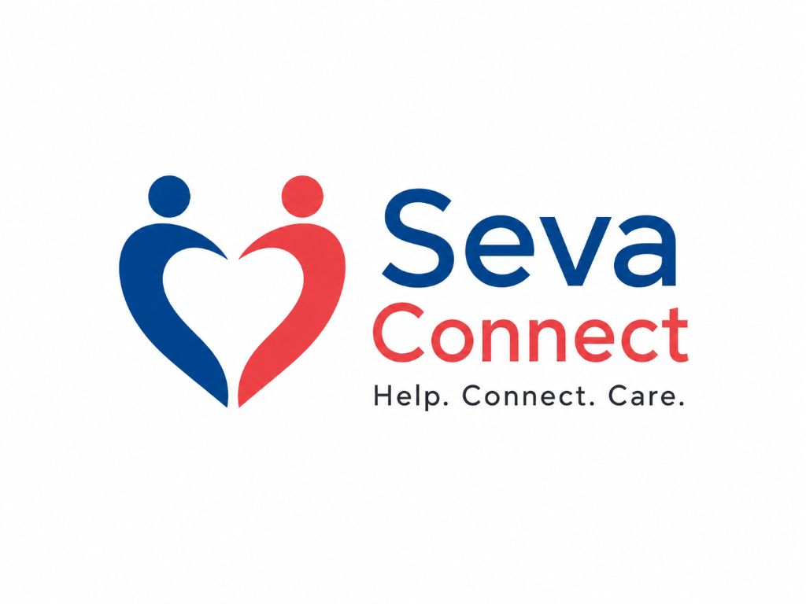

<div align="center">
  
  <h1>Seva Connect</h1>
  <p><strong>A Digital Humanitarian & Community Coordination Platform</strong></p>

  <p>
    <a href="#features">Features</a> •
    <a href="#architecture">Architecture</a> •
    <a href="#installation">Installation</a> •
    <a href="#admin-dashboard">Admin Dashboard</a> •
    <a href="#deployment">Deployment</a>
  </p>
</div>

---

## 🌍 About Seva Connect
**Seva Connect** is a responsive, single-page web application designed to empower local communities. It bridges the gap between those who need help and those willing to serve by coordinating volunteer efforts, managing emergency blood donation requests, and broadcasting community events.

Built with a focus on speed, accessibility, and zero-maintenance architecture, Seva Connect runs entirely on static web technologies backed by a real-time serverless database.

---

## ✨ Key Features
- **🩸 Emergency Blood Coordination:** A built-in system to accept urgent blood requests and coordinate donors in real-time.
- **🙋 Volunteer Management:** Seamless native registration for volunteers (Disaster Relief, Education, Health, etc.).
- **📅 Event Broadcasting:** Publicly display upcoming community initiatives (e.g., Blood Donation Camps, Food Drives).
- **🔒 Secure Admin Portal:** A built-in Single Page Application (SPA) dashboard for community leaders to manage all data securely.
- **📱 Mobile-First Design:** Fully responsive UI with smooth micro-animations and glassmorphism aesthetics.
- **🌗 Dark Mode Support:** Automatic and manual theme toggling for accessibility.

---

## 🛠️ Architecture & Tech Stack

Seva Connect is designed to be highly scalable and completely free to host.

* **Frontend:** Vanilla HTML5, CSS3 (Custom Properties/Variables), JavaScript (ES6+)
* **Backend & Database:** Google Firebase (Cloud Firestore)
* **Authentication:** Firebase Auth (Email/Password)
* **Hosting (Recommended):** GitHub Pages or Firebase Hosting
* **Design System:** Custom CSS without heavy frameworks for maximum performance.

---

## 🚀 Installation & Local Setup

Want to run Seva Connect on your local machine? It requires zero build steps!

1. **Clone the repository**
   ```bash
   git clone https://github.com/YOUR_GITHUB_USERNAME/seva-connect.git
   cd seva-connect
   ```

2. **Open the project**
   Because Seva Connect uses vanilla web technologies, you can simply open `index.html` in any modern web browser.
   
   *For the best development experience, use the [Live Server](https://marketplace.visualstudio.com/items?itemName=ritwickdey.LiveServer) extension in VS Code.*

3. **Configure Firebase (Optional for viewing, Required for data)**
   If you are forking this project, you must replace the Firebase config object in `script.js` and `admin.js` with your own Firebase project credentials.

---

## 🔐 Admin Dashboard

Seva Connect includes a secure, built-in Admin Dashboard (`auth.html`) that allows authorized users to manage the platform without touching the code.

**Dashboard Capabilities:**
- Real-time statistics (Active Volunteers, Open Requests, Active Events).
- View and manage incoming emergency help requests.
- Full CRUD (Create, Read, Update, Delete) interface for Community Events.
- Browse registered volunteer profiles.

*(Note: Access to the dashboard requires an authorized account created within your Firebase Console).*

---

## 🚢 Deployment

Seva Connect is optimized for static hosting.

**To deploy on GitHub Pages:**
1. Go to your repository settings on GitHub.
2. Navigate to **Pages** in the left sidebar.
3. Under **Build and deployment**, set the Source to `Deploy from a branch`.
4. Select the `main` branch and `/ (root)` folder.
5. Click **Save**. Your site will be live in minutes!

---

<div align="center">
  <p>Built with ❤️ for the community.</p>
  <p><em>परोपकाराय सतां विभूतयः</em> (The abilities and resources of noble people are meant for the welfare of others.)</p>
</div>
